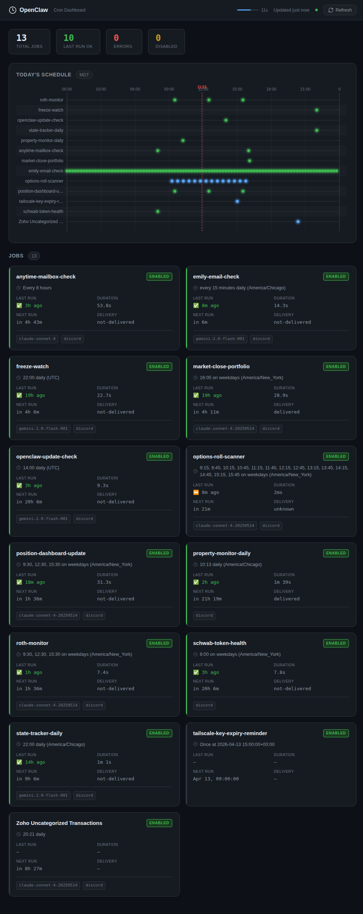

# OpenClaw Cron Dashboard

A lightweight, self-hosted web dashboard for visualizing [OpenClaw](https://github.com/openclaw/openclaw) cron jobs — schedules, status, run history, and output.



## Features

- **24-hour schedule timeline** — see when every job fires at a glance, with the current time highlighted
- **Job cards** — schedule (human-readable), last run status, duration, next run, error count
- **Run history panel** — click any job to see its last 50 runs with full output summaries
- **Token usage** — see input/output token counts per run
- **Auto-refresh** — polls every 30 seconds; progress bar shows time until next refresh
- **Dark theme** — easy on the eyes, looks great on a monitoring screen
- **Responsive** — works on mobile and desktop
- **Zero dependencies on the frontend** — pure HTML/CSS/JS, no framework required

## Quick Start

### With Docker (recommended)

```bash
docker run -d \
  --name openclaw-cron-dashboard \
  -p 3000:3000 \
  -v ~/.openclaw/cron:/data/cron:ro \
  -v /usr/local/bin/openclaw:/usr/local/bin/openclaw:ro \
  ghcr.io/your-org/openclaw-cron-dashboard:latest
```

Then open http://localhost:3000 in your browser.

### With Docker Compose

```bash
# Copy the example compose file
curl -O https://raw.githubusercontent.com/your-org/openclaw-cron-dashboard/main/docker-compose.yml

# Edit to adjust volume paths, then start:
docker compose up -d
```

### Without Docker

Requires Python 3.11+.

```bash
git clone https://github.com/your-org/openclaw-cron-dashboard.git
cd openclaw-cron-dashboard
python -m venv .venv
source .venv/bin/activate
pip install -r requirements.txt

# Point at your cron directory
export OPENCLAW_CRON_DIR=~/.openclaw/cron

# Optionally set the openclaw binary path
export OPENCLAW_BIN=openclaw

uvicorn server.main:app --host 0.0.0.0 --port 3000
```

Open http://localhost:3000.

## Configuration

All configuration is via environment variables:

| Variable | Default | Description |
|---|---|---|
| `PORT` | `3000` | HTTP port to listen on |
| `OPENCLAW_CRON_DIR` | `/data/cron` | Path to the OpenClaw cron directory (where `jobs.json` lives) |
| `OPENCLAW_BIN` | `openclaw` | Path to the `openclaw` CLI binary. Used to fetch run history. |

### Without the OpenClaw CLI

If `OPENCLAW_BIN` is not available in the container, the job list and timeline will still work (they read `jobs.json` directly). Run history will return empty results.

To enable run history, either:
1. Bind-mount the host binary into the container (see `docker-compose.yml`)
2. Install OpenClaw inside the image and use a custom `Dockerfile`

## API

The server exposes a simple REST API:

| Endpoint | Description |
|---|---|
| `GET /api/health` | Health check — returns version, config, and server timestamp |
| `GET /api/jobs` | All jobs with enriched schedule info and current state |
| `GET /api/jobs/:id/runs` | Run history for a specific job (query: `?limit=50`) |

### Example

```bash
# List all jobs
curl http://localhost:3000/api/jobs | jq .

# Get run history for a job
curl "http://localhost:3000/api/jobs/396c296b-7dee-4f95-99a3-18c97f210fbd/runs" | jq .

# Health check
curl http://localhost:3000/api/health
```

## File Structure

```
openclaw-cron-dashboard/
├── Dockerfile
├── docker-compose.yml
├── requirements.txt
├── README.md
├── LICENSE
├── .gitignore
├── .dockerignore
├── server/
│   ├── __init__.py
│   ├── main.py          # FastAPI server + API routes
│   ├── cron_reader.py   # Parse jobs.json, humanize schedules, compute timeline data
│   └── run_history.py   # Shell out to openclaw CLI for run history
└── public/
    ├── index.html       # App shell
    ├── style.css        # Dark theme styles
    └── app.js           # Frontend logic (vanilla JS)
```

## Building from Source

```bash
# Build the Docker image
docker build -t openclaw-cron-dashboard .

# Run it
docker run -d \
  -p 3000:3000 \
  -v ~/.openclaw/cron:/data/cron:ro \
  openclaw-cron-dashboard
```

## Development

```bash
python -m venv .venv
source .venv/bin/activate
pip install -r requirements.txt

# Auto-reload on file changes
OPENCLAW_CRON_DIR=~/.openclaw/cron uvicorn server.main:app --reload --host 0.0.0.0 --port 3000
```

## How It Works

1. **Job list** — reads `$OPENCLAW_CRON_DIR/jobs.json` directly on each request. No caching.
2. **Schedule humanization** — parses cron expressions server-side into readable strings like "9:30, 12:30, 15:30 on weekdays (America/New_York)".
3. **Timeline** — computes all firing times within the current day using `croniter`, returned as fractional positions [0, 1) along the day. Rendered client-side on an HTML canvas.
4. **Run history** — shells out to `openclaw cron runs --id <jobId>` and parses the JSON output. Config warnings on stderr are ignored.

## License

MIT — see [LICENSE](LICENSE).
